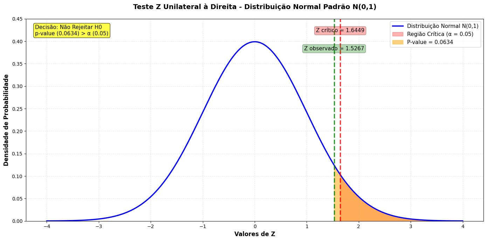

# Módulo 19 — Estatística Aplicada: Teste Z para Comparação de Médias

## 📋 Descrição do Problema

Uma escola quer avaliar qual das duas estratégias de ensino de matemática é mais eficaz para alunos do ensino médio.

Para isso, foram coletadas as notas de **50 alunos** submetidos à **Estratégia A** e **50 alunos** submetidos à **Estratégia B**, e aplicado um **Teste Z** para verificar se há diferença estatisticamente significativa entre as médias.

---

## 🎯 Hipóteses

| | Descrição |
|---|---|
| **H0** | A média das notas da Estratégia A é **igual** à da Estratégia B (μA = μB) |
| **H1** | A média das notas da Estratégia B é **maior** que a da Estratégia A (μB > μA) |

---

## 📁 Estrutura do Projeto

```
📦 modulo-19-estatistica
 ┗ 📓 Profissao_Cientista_de_Dados_M19_Pratique.ipynb
```

---

## 🔢 Resultados

### Estatísticas Descritivas

| Métrica | Estratégia A | Estratégia B |
|---|---|---|
| Média Amostral | 71.41 | 74.75 |
| Variância Amostral | 129.27 | 110.47 |
| Desvio Padrão | 11.37 | 10.51 |
| Tamanho da Amostra | 50 | 50 |

### Teste Z

| Parâmetro | Valor |
|---|---|
| Estatística Z calculada | 1.5267 |
| Valor Crítico (α = 0.05) | 1.6449 |
| P-value (unilateral direita) | 0.0634 |

### Decisão

> ✅ **Não rejeitamos H0.**
>
> O p-value (0.0634) é maior que o nível de significância α (0.05). Embora a Estratégia B apresente média amostral superior, essa diferença não é estatisticamente significativa ao nível de 5%. A diferença observada pode ser atribuída à variação aleatória amostral.

---

## 📊 Gráfico



O gráfico mostra a distribuição N(0,1) com o Z observado (verde) posicionado **à esquerda** do Z crítico (vermelho), confirmando visualmente a decisão de não rejeitar H0.

---

## 🛠️ Tecnologias Utilizadas

- Python 3.13
- NumPy
- SciPy
- Matplotlib
- Jupyter Notebook
